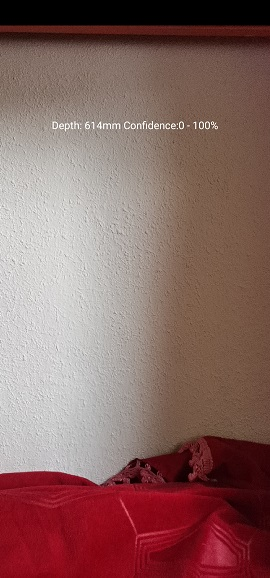
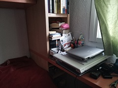
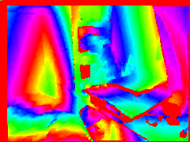

# HUAWEI AR Engine Demo

This if a fork of [hms-AREngine-demo](https://github.com/HMS-Core/hms-AREngine-demo)
I added 2 features :
- Measure : display the distance (depth) of the object to the camera (center depth pixel)
- Recorder : save camera image and depth every x seconds

## Measure

TODO:
- display something to understand where is measured the depth (like coloring the central pixel)

## Recorder

 

Features :
- Save depth (240x180) - (fancy png depth, binary depth16)
- Save rgb images (1440x1080)
- Save poses in CSV
- save rgbd ply

TODO:
- ply: strange colors
- ply: get depth sensor intrinsics
- save depth in tum format / how to save 16 bit monochrome PNG?
- understand why it's not possible to save image_preview in a better resolution / doesn't seem to be fixed in 2.13 - [github issue](https://github.com/HMS-Core/hms-AREngine-demo/issues/7)

Camera Intrinsics (Honor View 20 - AR Engine)
- principalPoint : 536.58673 718.911
- imageDimensions : 1080 1440
- distortions : 0.122519 -0.229927 0.144746 -6.96E-4 -4.39E-4
- focalLength : 1075.7473 1072.9441 #in px - Why 2 values ?
Calculated:
- 0fov: Math.atan2(1440/2,1075.7473)*180/Math.PI*2=67.6
- 1fov: Math.atan2(1080/2,1075.7473)*180/Math.PI*2=53.3
- diagonal : Math.sqrt(Math.pow(1080,2)+Math.pow(1440,2))=1800
- diafov: Math.atan2(1800/2,1075.7473)*180/Math.PI*2=79.8

Camera Intrinsics (Huawei P20 Pro - AR Engine)
- principalPoint: 535.04553 729.8055
- imageDimensions : 1080 1440
- distortions : 0.093129 -0.187359 0.138948 1.34E-4 -4.29E-4
- focalLength : 1101.3862 1100.9385

To get both depth and RGB : 
- AR Engine : [ARFrame](https://developer.huawei.com/consumer/en/doc/HMSCore-References-V5/frame-0000001050121447-V5)
- ARCore + Camera2 API ? : [SharedCamera](https://developers.google.com/ar/reference/java/com/google/ar/core/SharedCamera) - [Doc](https://developers.google.com/ar/develop/java/camera-sharing)
- Camera2 API?