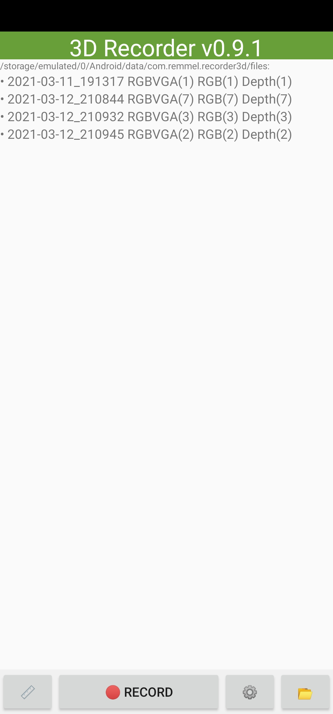
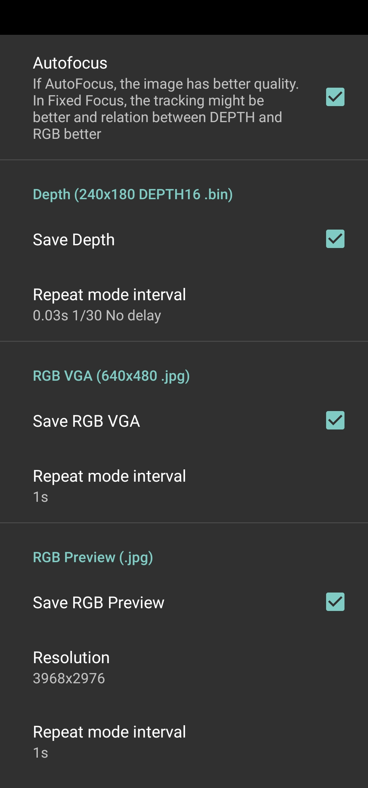
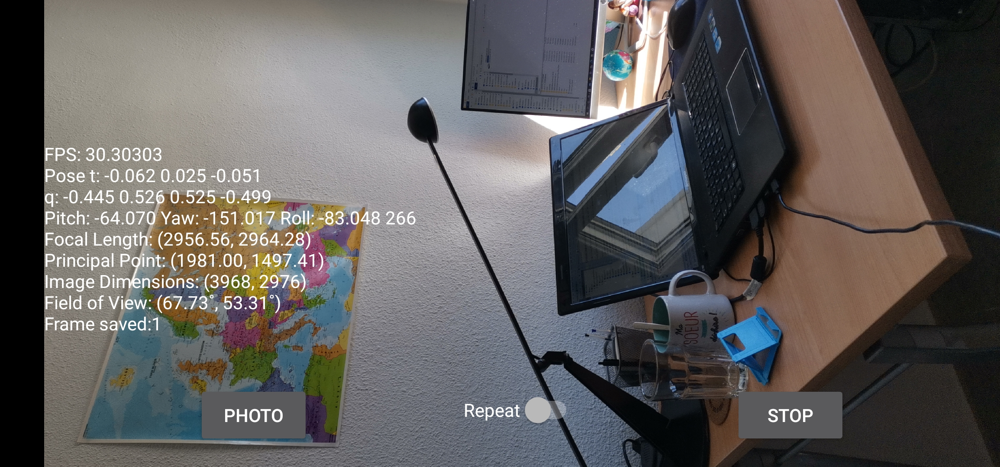

# 3D Recorder

3D Recorder allows you to save the RGB and Depth images along their world poses (rotation and position) from your Huawei phone (with a Tof camera).

Thoses information can later be visualized in my [online viewer](https://remmel.github.com/image-processing-js/pose-viewer.html).

You can choose how often to save the images and the rgb resolution (up to 3968x2976). Thus if you choose a small resolution (eg 1440x1080) you can create a [3d video](https://remy-mellet.com/image-processing-js/rgbds-viewer.html).  
If you choose a too big resolution the fps will drop and thus a few images per second will be saved.

  

## Features
- Save depth (240x180, binary DEPTH16)
- Save 2 rgb images (1 VGA + 1 with choosen resolution max 3264x2448)
- Save poses in CSV [download](doc/poses.csv)
- (from Android Studio) Save rgbd ply [download](Recorder3D/src/test/resources/00000012.ply) (TODO enable it from UI)
- (from Android Studio) Export to PNG Grayscale 16bits (tum; openCV: CV_16UC1) (TODO enable it from UI)

## Todo
- Add FileManager to export to PNG grayscale, PLY, merge PLYs
- Integrate the online pose-viewer in the app

## Bonus feature : Measure

Measure the distance of the center (depth) of the object to the camera (center depth pixel)

## Android smarphone

That app has only been tested on Honor View 20 which has a tof sensor. This is the cheapest Huawei phone with Tof, you can find 2nd hand around 180€.